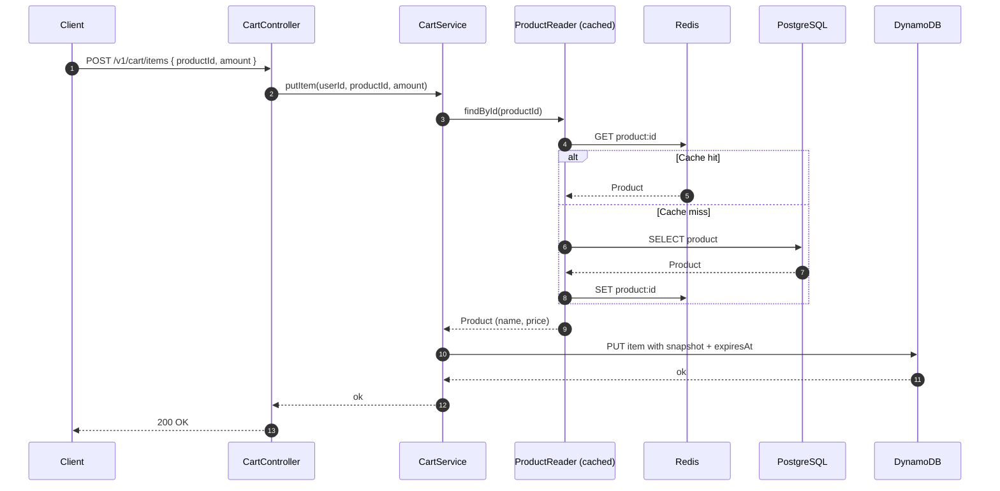
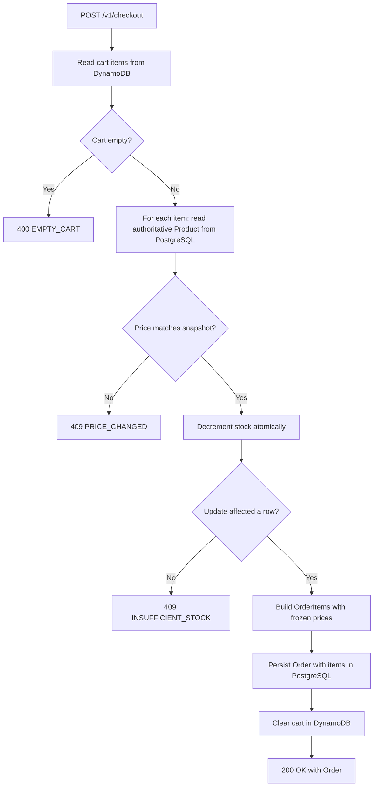

# E-commerce Cart API

[](#)
[](#)
[](#)
[](#)
[](#)
[](#)

A shopping cart and checkout service built with Java 25 and Spring Boot 4. Uses DynamoDB for cart persistence with single-table design and TTL-based expiration, PostgreSQL for the authoritative product catalog and order history, and Redis as a cache layer for product reads. Features a price-snapshot model with checkout-time reconciliation, atomic stock decrement to prevent overselling, and a decorator-based cache strategy that lets each consumer choose between cached and authoritative reads.

## Table of Contents

- [Architecture and Features](#architecture-and-features)
    - [Single-Table Design in DynamoDB](#single-table-design-in-dynamodb)
    - [Cart Item Lifecycle with TTL](#cart-item-lifecycle-with-ttl)
    - [Price Snapshot and Checkout Reconciliation](#price-snapshot-and-checkout-reconciliation)
    - [Atomic Stock Decrement](#atomic-stock-decrement)
    - [Cache Strategy via Decorator Pattern](#cache-strategy-via-decorator-pattern)
- [Design Decisions and Trade-offs](#design-decisions-and-trade-offs)
    - [DynamoDB for Cart, PostgreSQL for Order](#dynamodb-for-cart-postgresql-for-order)
    - [Single-Table Design vs Multiple Tables](#single-table-design-vs-multiple-tables)
    - [Snapshot Fields Stored Inside the Cart Item](#snapshot-fields-stored-inside-the-cart-item)
    - [Decorator Pattern Instead of @Cacheable](#decorator-pattern-instead-of-cacheable)
    - [Reject on Price Mismatch](#reject-on-price-mismatch)
    - [Cache as UX, Not Source of Truth](#cache-as-ux-not-source-of-truth)
- [Limitations and Future Improvements](#limitations-and-future-improvements)
- [Tech Stack](#tech-stack)
- [Getting Started](#getting-started)
- [Access Points](#access-points)
- [API Documentation](#api-documentation)
- [Run Tests](#run-tests)

## Architecture and Features

### Single-Table Design in DynamoDB

Cart items live in a single DynamoDB table with a composite primary key. The partition key (`PK`) groups all items belonging to the same user; the sort key (`SK`) identifies each product within that cart. A single `Query` by partition key returns the full cart in one request, with no joins, no fan-out, and no application-side aggregation.

Item shape:

```
PK:         CART#<userId>
SK:         PROD#<productId>
productId:  <productId>
amount:     <int>
name:       <string>      (snapshot)
price:      <decimal>     (snapshot)
expiresAt:  <epoch_seconds>
```

The `productId` is duplicated as a top-level attribute rather than parsed from the `SK` prefix. Reads stay clean, and a future GSI on `productId` becomes possible without restructuring.

<details>
<summary>Add-to-Cart Sequence Diagram</summary>



</details>

### Cart Item Lifecycle with TTL

Every cart item carries an `expiresAt` attribute (Unix epoch seconds) refreshed on every write. DynamoDB removes expired items automatically via the native TTL feature, with no scheduled cleanup job, no cron, no maintenance. Active carts keep extending their lifetime; abandoned carts disappear after the TTL window without manual intervention.

### Price Snapshot and Checkout Reconciliation

When a product is added to the cart, its current `name` and `price` are captured into the cart item itself. The cart becomes self-contained: rendering it requires no further lookups, and the user always sees the price they originally committed to.

At checkout, the service reads each product fresh from PostgreSQL (bypassing the cache) and compares the stored snapshot against the current state. Any mismatch aborts the checkout with a structured `PRICE_CHANGED` error containing both the expected and current prices, allowing the frontend to surface the difference and prompt for re-confirmation.

<details>
<summary>Checkout Flow Diagram</summary>



</details>

### Atomic Stock Decrement

Stock decrement runs as a single conditional `UPDATE` on PostgreSQL:

```sql
UPDATE products
SET stock = stock - :amount
WHERE id = :productId AND stock >= :amount
```

If two concurrent checkouts target the last unit, exactly one of the `UPDATE`s affects a row; the other affects zero rows and the corresponding checkout fails with `INSUFFICIENT_STOCK`. No application-level locking, no read-then-write race window.

The full checkout runs inside a single Spring `@Transactional` boundary, so a stock failure on the third item rolls back the decrements of the first two automatically.

### Cache Strategy via Decorator Pattern

Product reads pass through a chain of `ProductService` implementations composed via the decorator pattern:

- `DatabaseProductService`: talks directly to PostgreSQL.
- `CachedProductService`: wraps the database service, adding cache-aside reads and write-through invalidation on Redis.
- `WriteThroughProductService`: composes both. Reads go to the database service for authoritative data; writes go to the cached service so cache invalidation always happens.

Consumers inject the variant matching their needs:

| Consumer | Bean | Read path | Write path |
|---|---|---|---|
| `CartService` | `CachedProductService` | Cache-first | Invalidates cache |
| `ProductController` (CRUD) | `CachedProductService` | Cache-first | Invalidates cache |
| `CheckoutService` | `WriteThroughProductService` | Database (authoritative) | Through cache (invalidates) |

The pattern keeps cache concerns out of business code. `CartService` does not know Redis exists; it just calls `findById`. `CheckoutService` does not annotate methods with `@CacheEvict`; the `WriteThroughProductService` handles invalidation transparently. Switching cache providers, removing the cache, or adding a new consumer with different requirements only touches the composition layer, never the consumers.

## Design Decisions and Trade-offs

### DynamoDB for Cart, PostgreSQL for Order

**Decision:** Active carts live in DynamoDB; confirmed orders live in PostgreSQL.

- **Rationale:** Cart access patterns are key-based (always by `userId`), high-write under load (every add/remove), and benefit from horizontal scaling, single-digit millisecond reads, and native TTL for abandoned-cart cleanup. Orders are transactional records with relational queries (history, filtering, reporting), strong consistency requirements, and no need for the throughput profile of a NoSQL store.
- **Trade-off:** The system spans two persistence technologies, increasing operational complexity. Cross-store consistency between cart and order state during checkout falls under the Dual-Write Problem (see Limitations).

### Single-Table Design vs Multiple Tables

**Decision:** All cart items use a single DynamoDB table with composite key (`PK = CART#<userId>`, `SK = PROD#<productId>`), following the single-table design pattern.

- **Rationale:** A single `Query` retrieves the full cart in one round trip. Future expansion (cart metadata, applied coupons, shipping address drafts) can use the same partition with different `SK` prefixes (`SK = METADATA`, `SK = COUPON#<code>`) and still load atomically with one query. Multiple tables would require parallel calls and lose the atomic-load property.
- **Trade-off:** Code mapping items from the table needs to inspect the `SK` prefix or a `type` attribute to route to the right object. Simpler than a join, but less direct than typed tables in SQL.

### Snapshot Fields Stored Inside the Cart Item

**Decision:** Cart items store a frozen `name` and `price` at the time of add-to-cart, alongside the `productId` reference.

- **Rationale:** Two benefits. First, rendering the cart needs no further lookups, removing N+1 reads from the hot path. Second, the user sees a stable price between add-to-cart and checkout, which is a real product requirement (price changes mid-session lead to abandonment and complaints).
- **Trade-off:** If the product name or other display fields change after the item is added, the cart shows the old version until the user removes and re-adds. For price specifically, this is by design and reconciled at checkout. For name and similar metadata, it is an accepted minor inconsistency.

### Decorator Pattern Instead of @Cacheable

**Decision:** Cache logic is implemented through explicit decorator classes rather than `@Cacheable` annotations on a shared service.

- **Rationale:** Different consumers need different cache behaviors. `CartService` benefits from cached reads; `CheckoutService` requires authoritative reads to validate price and decrement stock. A single annotated method cannot satisfy both. The decorator pattern allows each consumer to inject the variant matching its consistency requirements without exposing cache concerns to the business code.
- **Trade-off:** More explicit configuration than `@Cacheable`. Three classes (`DatabaseProductService`, `CachedProductService`, `WriteThroughProductService`) instead of one annotated service. The added structure is justified by the consumer separation but would be overkill for a system with uniform cache requirements.

### Reject on Price Mismatch

**Decision:** Checkout aborts with `409 PRICE_CHANGED` when the stored snapshot differs from the current product price, returning both prices in the error payload.

- **Rationale:** Charging the user a different price from what they saw is a trust failure. Returning the divergence explicitly lets the frontend show "the price changed from X to Y, do you want to continue?" and reissue the checkout with the user's confirmation. This is closer to how real e-commerce checkout flows behave.
- **Trade-off:** A burst of concurrent price updates near checkout time creates retries. Acceptable cost for the trust property.

### Cache as UX, Not Source of Truth

**Decision:** Redis caches product data including stock for read endpoints, but no transactional decision relies on cached values.

- **Rationale:** The cache exists to keep listing and add-to-cart fast. Stock displayed in catalog endpoints can be slightly stale (up to the cache TTL), but this is acceptable because the actual decision (can the user buy this?) happens at checkout against the authoritative database with atomic decrement. Treating the cache as informational instead of authoritative simplifies invalidation rules and removes the temptation to use it as a fast path for transactional logic.
- **Trade-off:** A user might see "10 in stock" in the catalog and receive `INSUFFICIENT_STOCK` at checkout. This is the same behavior as major e-commerce sites and reflects the underlying reality that the displayed stock is a hint, not a guarantee.

## Limitations and Future Improvements

- **Dual-Write between PostgreSQL and DynamoDB:** Checkout commits the order in PostgreSQL and then clears the cart in DynamoDB. If the cart cleanup fails after the order commits, the cart retains stale items. Risk is bounded (the order is durable; cart inconsistency is recoverable on next user action), but a production system would address this with the Transactional Outbox pattern or compensating actions.

- **No retry for DynamoDB UnprocessedItems:** `BatchWriteItem` operations (used in cart cleanup) can return partial success. The current code does not retry unprocessed items with backoff. Production code would loop on `UnprocessedItems` until empty or a retry budget is exhausted.

- **No reservation at add-to-cart:** Stock is only decremented at checkout. Two users adding the last unit to their carts will see no friction until one of them checks out. A reservation model with TTL would surface contention earlier but adds significant complexity (reservation expiry, double-bookkeeping) that primarily benefits high-contention scenarios.

- **No idempotency key on checkout:** A retried checkout request after a network blip could create a duplicate order. Production payment APIs typically require an `Idempotency-Key` header and persist a short-lived mapping from key to result.

- **No thundering-herd protection on cache:** A popular product whose cache entry expires under load triggers concurrent database reads. A distributed lock with double-checked locking would limit the stampede. The pattern is implemented in another project ([url-shortening](https://github.com/pedroheing/url-shortening)) and was deliberately omitted here to keep focus on the cart-specific concerns.

- **Authentication is opaque-token based:** Tokens are random strings stored in PostgreSQL and validated by lookup. This is sufficient to demonstrate the cart and checkout flow but should be replaced with JWT or proper Spring Security in any production deployment.

## Tech Stack

- **Runtime:** Java 25 (LTS)
- **Framework:** Spring Boot 4
- **Authoritative store:** PostgreSQL 17
- **Cart store:** Amazon DynamoDB (LocalStack for local dev)
- **Cache:** Redis 8
- **ORM:** Spring Data JPA / Hibernate
- **Build:** Maven
- **Infrastructure:** Docker, Docker Compose

## Getting Started

### Prerequisites

- Docker Engine
- Docker Compose

### Installation

```bash
git clone https://github.com/pedroheing/ecommerce-cart-api.git && cd ecommerce-cart-api
```

### Configuration

The application is preconfigured for the Docker environment. Override variables via environment if needed.

| Variable | Description | Default |
|---|---|---|
| `DB_HOST` | PostgreSQL host | `postgres` |
| `DB_PORT` | PostgreSQL port | `5432` |
| `DB_NAME` | Database name | `shopping_cart` |
| `DB_USER` | Database user | `postgres` |
| `DB_PASSWORD` | Database password | `postgres` |
| `REDIS_HOST` | Redis host | `redis` |
| `REDIS_PORT` | Redis port | `6379` |
| `DYNAMO_ENDPOINT` | DynamoDB endpoint | `http://localstack:4566` |
| `AWS_REGION` | AWS region | `us-east-1` |

### Execution

Full stack (recommended for end-to-end usage):

```bash
docker compose up --build
```

This builds the application image, starts PostgreSQL, Redis, and LocalStack with DynamoDB, runs the LocalStack init script to create the cart table with TTL, and waits for all dependencies to be healthy before starting the app.

Dependencies only (for running the app from an IDE):

```bash
docker compose -f docker-compose.dev.yml up
```

## Access Points

| Service | URL | Notes |
|---|---|---|
| API | `http://localhost:8080/v1` | Base path |
| Swagger UI | `http://localhost:8080/swagger-ui.html` | Interactive API docs |
| PostgreSQL | `localhost:5432` | User: `postgres` / Pass: `postgres` (dev only) |
| Redis Insight | `http://localhost:5540` | Available in dev compose |
| LocalStack | `http://localhost:4566` | DynamoDB emulator |

## API Documentation

Full schema is available via Swagger UI. The main endpoints:

**Users**
- `POST /v1/users`: create a user, returns the authentication token
- `PATCH /v1/users/{id}`: update name or email

**Products**
- `POST /v1/products`: create a product
- `GET /v1/products/{id}`: read a product (cached)
- `PATCH /v1/products/{id}`: partial update of name and price
- `DELETE /v1/products/{id}`: remove a product

**Cart** (requires `Authorization: Bearer <token>`)
- `POST /v1/cart/items`: add or update an item with snapshot
- `GET /v1/cart`: list cart items
- `DELETE /v1/cart/items/{productId}`: remove an item
- `DELETE /v1/cart`: clear the cart

**Checkout** (requires `Authorization: Bearer <token>`)
- `POST /v1/checkout`: validate prices, decrement stock atomically, create order, clear cart

**Orders** (requires `Authorization: Bearer <token>`)
- `GET /v1/orders/{id}`: read a single order
- `GET /v1/orders`: list orders for the authenticated user

## Run Tests

```bash
./mvnw test
```

The test suite focuses on unit tests of business logic in services using JUnit 5 and Mockito.